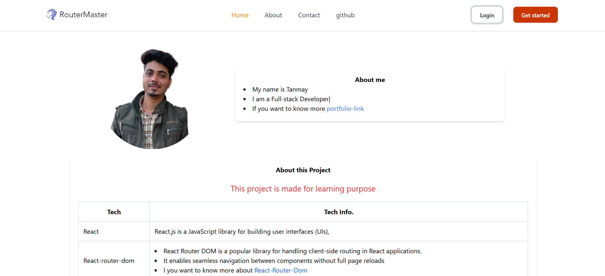
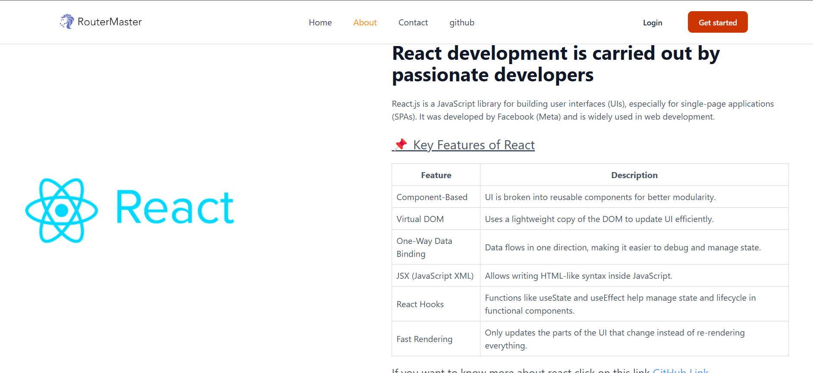
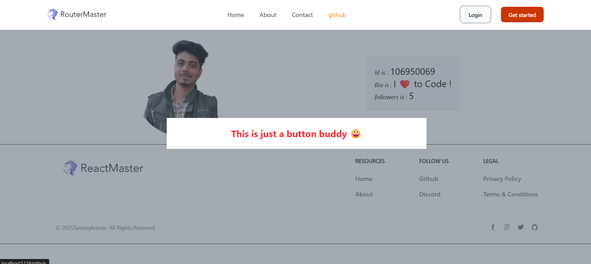
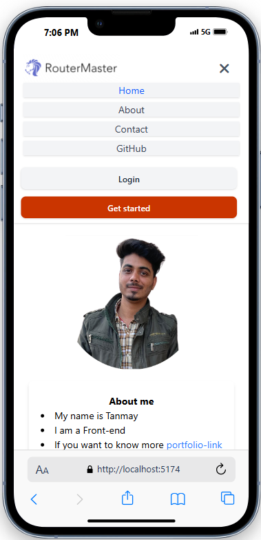
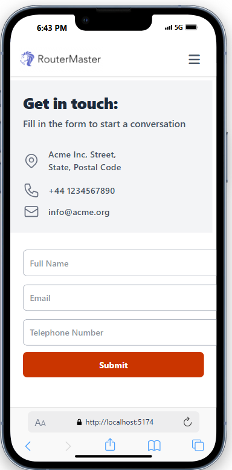
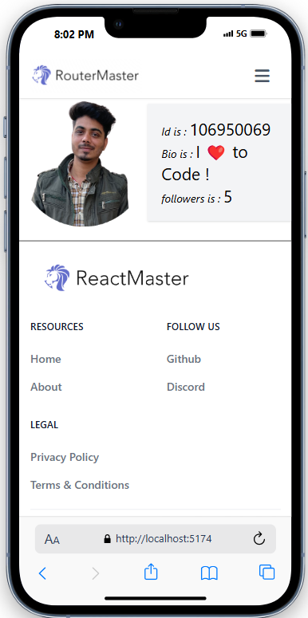
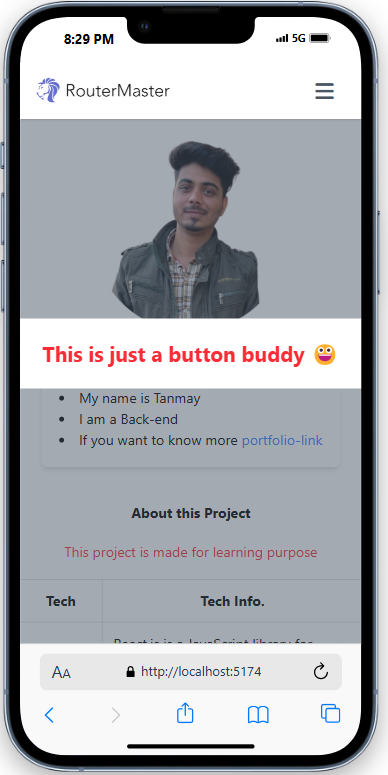

<h1 align = "center">⚛ React Router Master ⚛</h1>

- This project is a React Router Master Project, demonstrating the implementation of client-side routing in React using React Router DOM.
- It includes navigation, nested routes, authentication handling, and dynamic route parameters.
- Building this Web app with intention of learning React and react-router-dom better .

## 🚀 Features

- 🔹 Dynamic Routing: Navigate between different pages seamlessly.

- 🔹 Nested Routes: Handle complex UI structures.

- 🔹 URL Parameters & Queries: Manage dynamic content.

- 🔹 Fetched data from API.

## 🏗️ Tech Stack

- ⚛ React - Frontend framework

- 🔄 React Router DOM - Client-side routing

- 🎨 Tailwind CSS (or your preferred CSS framework) - Styling

- 🛠 Vite/Webpack - Build tool

- 📌 react-type-animation

## 📸 screenshot

<h1 align = "center">Desktop view</h1>
<table border="1">
  <thead>
    <tr>
      <th style="text-align:center;" >Home</th>
    </tr>
  </thead>
  <tbody>
    <tr>
      <td></img></td>
    </tr>
  </tbody>
</table>
<table border="1">
  <thead>
    <tr>
      <th style="text-align:center;" >About</th>
      <th style="text-align:center;" >Portal</th>
    </tr>
  </thead>
  <tbody>
    <tr>
      <td></img></td>
      <td></img></td>
    </tr>
  </tbody>
</table>

<h1 align = "center">Mobile view</h1>
<table border="1" align = "center">
  <thead>
    <tr>
      <th style="text-align:center;" >Home / Nav</th>
      <th style="text-align:center;" >Contact</th>
    </tr>
  </thead>
  <tbody>
    <tr>
      <td></img></td>
      <td></img></td>
    </tr>
  </tbody>
</table>
<table border="1" align = "center">
  <thead>
    <tr>
      <th style="text-align:center;" >Git API data</th>
      <th style="text-align:center;" >Portal</th>
    </tr>
  </thead>
  <tbody>
    <tr>
      <td></img></td>
      <td></img></td>
    </tr>
  </tbody>
</table>

## 📜 License

```
©️2025

This project is licensed under the MIT License.
```
